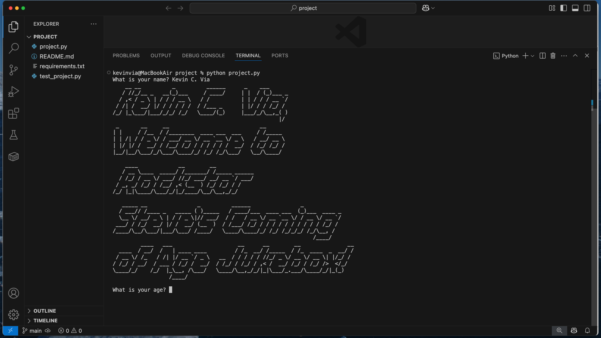
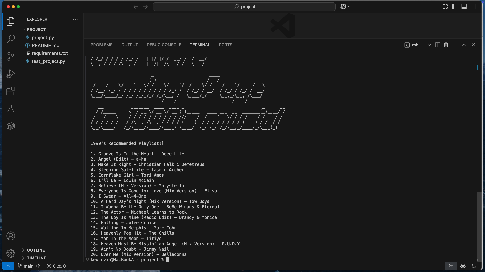

# 🎸 Rockstar Steve's Coming of Age Jukebox

### 🖥️ [🎬 Video Demo](https://youtu.be/zc1A0DOT2Wc?si=FHr4bMu3HRVjoiol)

A nostalgic Python-powered jukebox that generates a personalized playlist from the iTunes API based on your age and graduation decade — all with some rockstar flair in ASCII art. Built as my CS50P final project and inspired by my late brother-in-law, Steve, this project combines figlet-based terminal visuals with real music data.




---

## 🎯 Features

- 🎵 Queries iTunes API for decade-based "Hits Essentials" playlists
- 🎲 Randomly selects 20 songs from your era
- 🤘 Stylish figlet ASCII welcome and messaging using `pyfiglet`
- 🎓 Calculates your high school graduation year based on age
- 🧪 Comes with a test suite using `pytest`

---

## 🧠 How It Works

1. Asks for your **name** and **age**
2. Calculates your high school graduation **decade**
3. Searches iTunes for that decade’s **Hits Essentials** playlist
4. Randomly selects 20 tracks to create your **coming-of-age jukebox**

---

## 🧪 Install & Run

```bash
pip install -r requirements.txt
python project.py
```

> Ensure you have Python 3 installed and internet access to reach the iTunes API.

---

## 🛠️ Requirements

```text
requests
pyfiglet
```

---

## 📂 Project Structure

```
📁 project/
├── project.py             # Main app
├── test_project.py        # Unit tests
├── requirements.txt
├── README.md
├── Output_1.jpeg          # Terminal welcome screenshot
└── output_2.jpeg          # Generated playlist screenshot
```

---

## 💡 Inspiration

This project honors my late brother-in-law, Steve, and brings together my love for music, programming, and creativity. It also served as a hands-on final for [Harvard's CS50P Python course](https://cs50.harvard.edu/python).

---

## 🔗 Connect with Me

- GitHub: [59LesPaulMan](https://github.com/59LesPaulMan)
- LinkedIn: [Kevin Via](https://www.linkedin.com/in/kevinvia/)
- Email: kevin.c.via11@gmail.com
